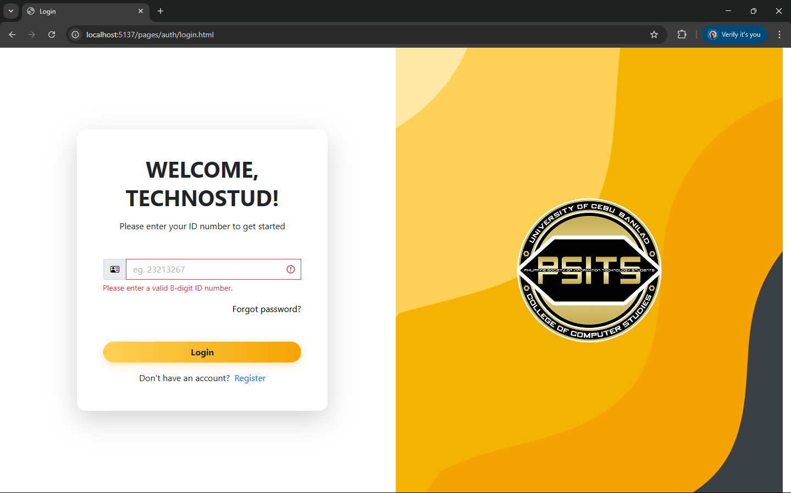
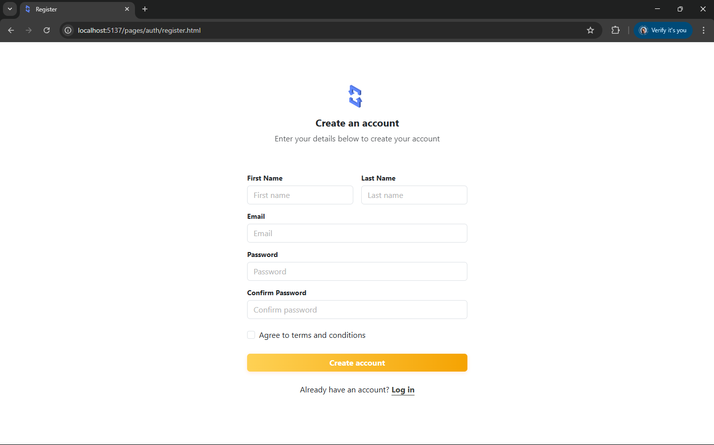
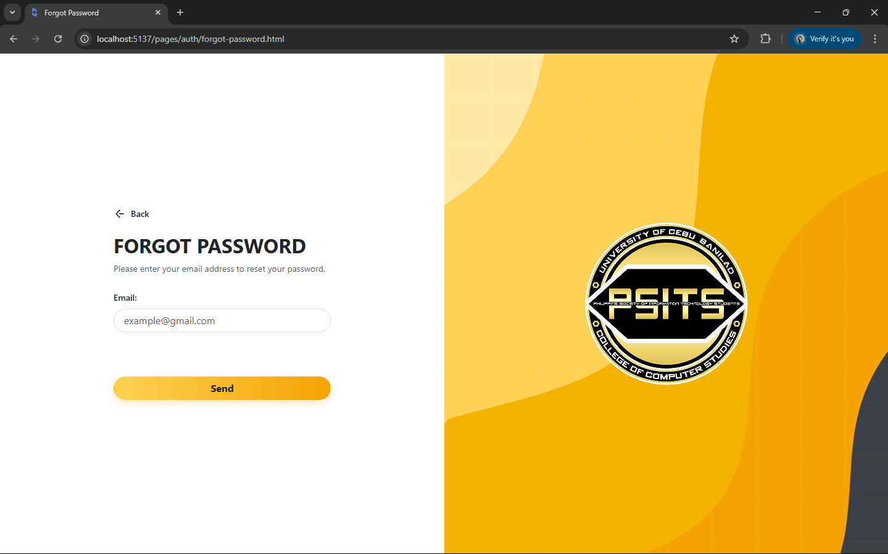
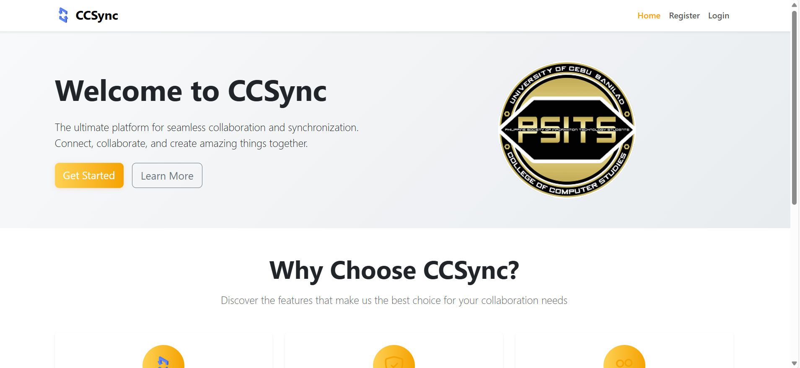
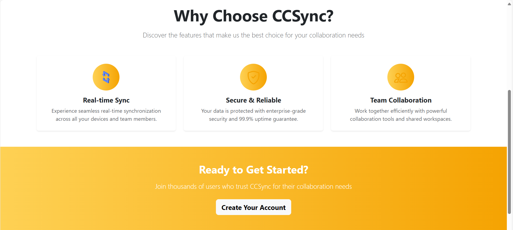
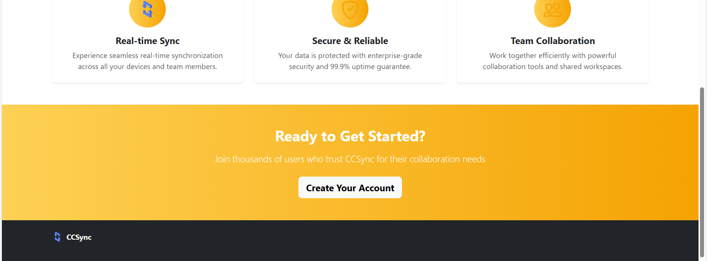

# CCSync: A PHP-Based Student and Semestral Management System for Digitized Record Keeping and Record Efficiency
**Live Demo:** [https://radleigh123.github.io/ccsync-v1/](https://radleigh123.github.io/ccsync-v1/)

## 📌 Project Description  
**CCSync** is a PHP-based student and semestral management platform designed to streamline and digitize organizational processes, starting with the College of Computer Studies.  
It manages student records, requirements, events, and officer information, ensuring smooth and paperless transactions.  
The system aims to replace manual forms and logs for semestral requirements (such as membership fees and event attendance) with a centralized, consistent, and accessible platform.  

---

## 👥 Group Members  
- **IGOT, Went Ruzel**  
- **INTING, Keane Radleigh**  
- **JAKOSALEM, Joshua**  
- **TUNDAG, Laine Pearl** 

## 📸 Screenshots 

- **Login Page**  
  

- **Register Page**  
  

- **Forgot Password Page**  


**Home Page**




---

**Steps to replicate**
```bash
npm install

# development
npm run dev
# production
npm start
```

### Project structure
```
ccsync-v1/
│
├── src/
│   ├── index.html                # Main entry HTML
│   ├── pages/                    # All HTML pages (login, dashboard, etc.)
│   │   ├── auth/
│   │   │   └── login.html
│   │   │   └── register.html
│   │   │   └── forgot-password.html
│   │   ├── dashboard/
│   │   │   └── dashboard.html
│   ├── js/
│   │   ├── main.js               # Main JS entry
│   │   ├── components/           
│   │   └── pages/                # JS specific to each page
│   ├── scss/
│   │   ├── styles.scss           # Main SCSS entry
│   │   ├── components/           
│   │   ├── pages/                # SCSS for specific pages
│   └── assets/                   # Images, fonts, etc.
│
├── public/                       # Static files (if needed)
│
├── vite.config.js
├── package.json
└── README.md
```
#### Custom styles
Elements that are commonly used throughout the app can be placed in the main SCSS, for ease of access. For specific ones, they can be placed on a seperate file located parallel to their HTML.

| Current overridden classes | description |
| - | - |
| `btn-primary-ccsync` | lorem ipsum |
| `link-primary-ccsync` | lorem ipsum |

| Current overridden pseudo-classes | description |
| - | - |
| `input.form-control:focus`  | lorem ipsum |

### Additionals
**Helpful plugins**
- **Todo Tree** (Gruntfuggly) - helps identify and list out TODOs
- **Bootstrap 5 Quick Snippets** (Anbuselvan Rocky) - helpful snippets for quick development

<br>

---
Documentation:
- https://getbootstrap.com/docs/5.3/getting-started/vite/